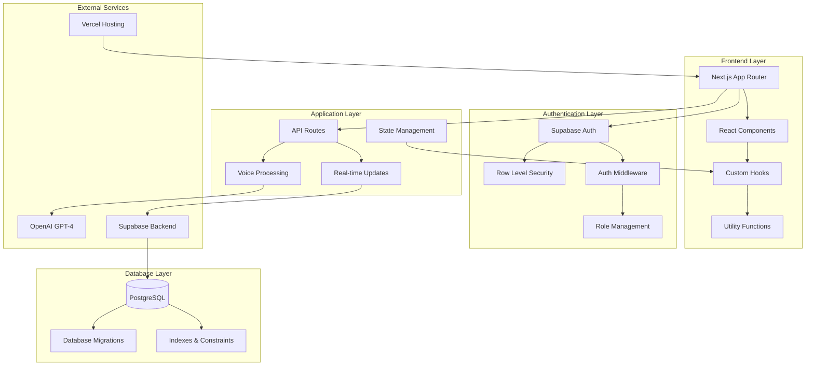
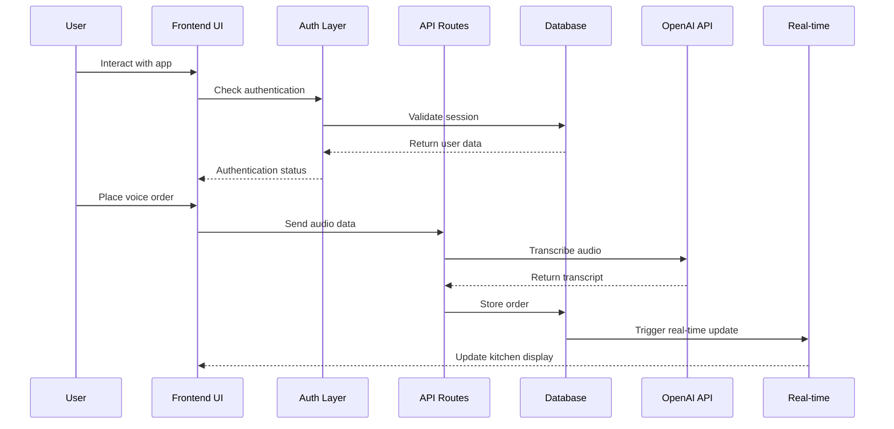
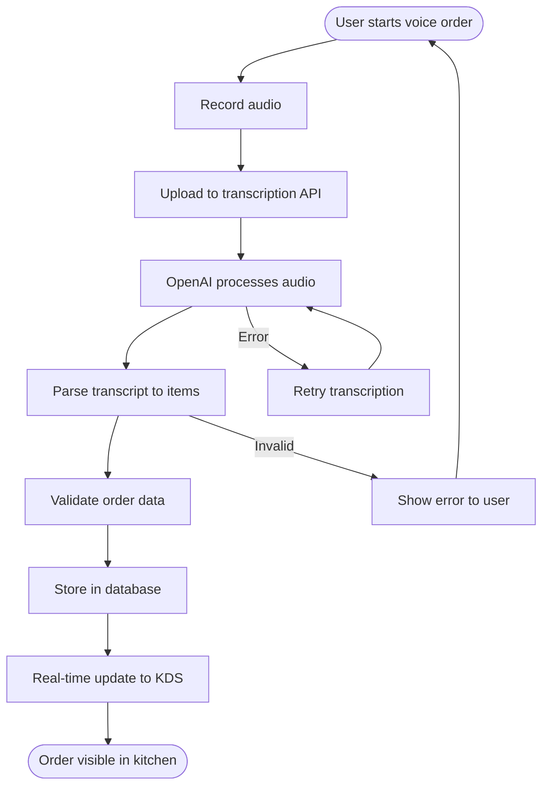
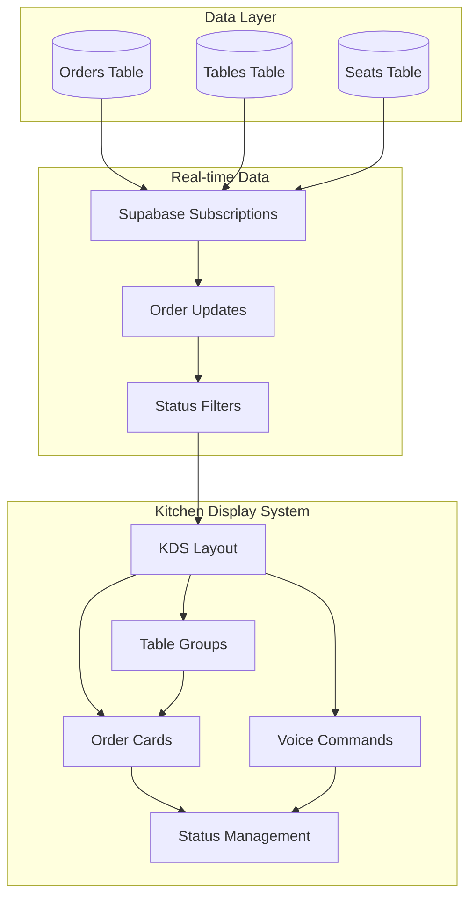
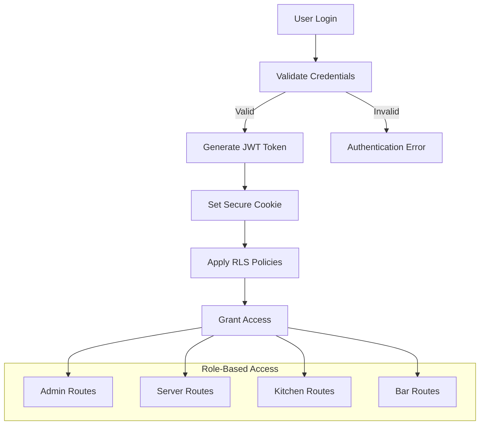
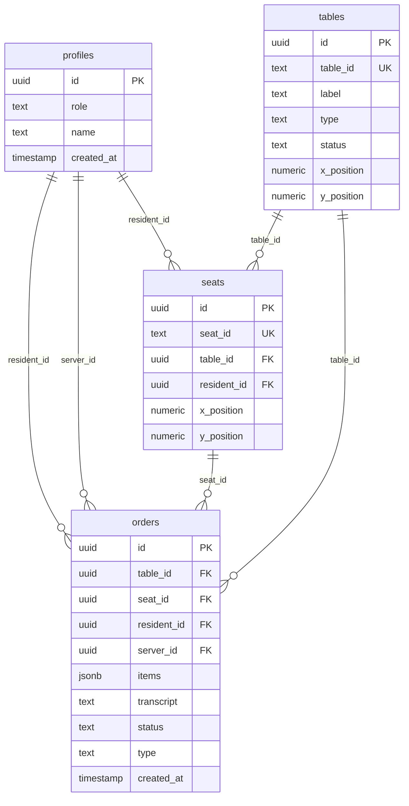
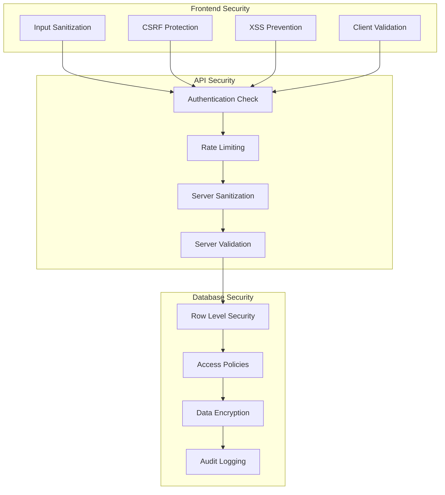
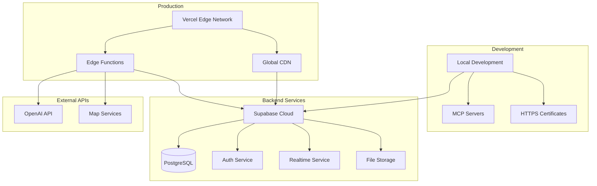
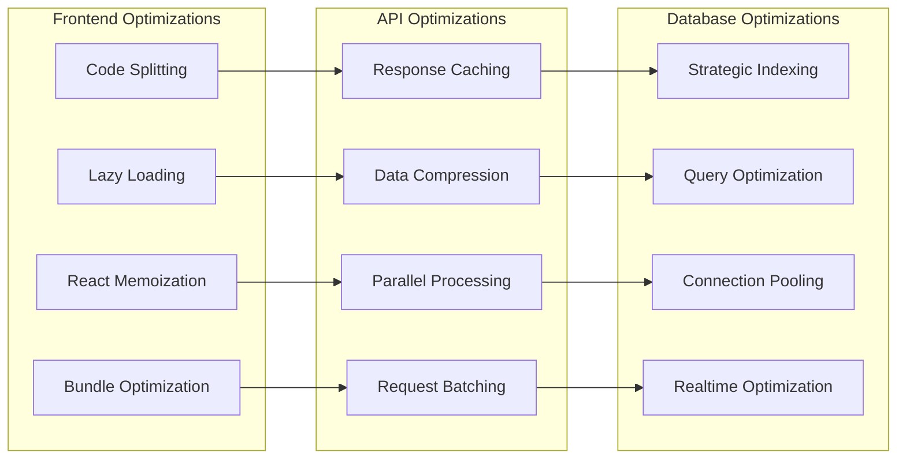

# PLATE RESTAURANT SYSTEM - ARCHITECTURE DIAGRAM

## System Overview



## Detailed Component Architecture

```mermaid
graph LR
    subgraph "App Router Structure"
        Root[app/layout.tsx]
        Auth[app/(auth)/layout.tsx]
        Pages[Route Pages]
        API[app/api/*]
    end
    
    subgraph "Component Library"
        UI[components/ui/*]
        Domain[Domain Components]
        KDS[components/kds/*]
        FloorPlan[components/floor-plan/*]
    end
    
    subgraph "Business Logic"
        ModAssembly[lib/modassembly/*]
        Hooks[lib/hooks/*]
        Utils[lib/utils.ts]
    end
    
    Root --> Auth
    Auth --> Pages
    Root --> API
    Pages --> Domain
    Domain --> UI
    Domain --> KDS
    Domain --> FloorPlan
    Domain --> Hooks
    Hooks --> ModAssembly
    Hooks --> Utils
    API --> ModAssembly
```

## Data Flow Architecture



## Voice Ordering System Flow



## Kitchen Display System Architecture



## Authentication & Authorization Flow



## Database Schema Relationships



## Security Architecture



## Deployment Architecture



## Performance Optimization Points



## Technology Stack Layers

```ascii
┌─────────────────────────────────────────────────────────┐
│                    FRONTEND LAYER                       │
│  Next.js 15 • React 19 • TypeScript • Tailwind CSS    │
│  shadcn/ui • Framer Motion • Lucide Icons             │
└─────────────────────────────────────────────────────────┘
┌─────────────────────────────────────────────────────────┐
│                 APPLICATION LAYER                       │
│  Custom Hooks • Voice Processing • Real-time Updates   │
│  State Management • Error Boundaries • Performance     │
└─────────────────────────────────────────────────────────┘
┌─────────────────────────────────────────────────────────┐
│                   BUSINESS LAYER                        │
│  Modular Assembly • Repository Pattern • Validation    │
│  Order Processing • Suggestion Engine • Floor Plans    │
└─────────────────────────────────────────────────────────┘
┌─────────────────────────────────────────────────────────┐
│                   SECURITY LAYER                        │
│  Authentication • Authorization • RLS • Input Sanit.   │
│  Rate Limiting • CSRF Protection • Secure Cookies      │
└─────────────────────────────────────────────────────────┘
┌─────────────────────────────────────────────────────────┐
│                    DATA LAYER                           │
│  Supabase • PostgreSQL • Real-time • File Storage      │
│  Migrations • Indexes • Constraints • Backup           │
└─────────────────────────────────────────────────────────┘
┌─────────────────────────────────────────────────────────┐
│                 INFRASTRUCTURE LAYER                    │
│  Vercel Edge • CDN • OpenAI API • Monitoring           │
│  SSL/TLS • Edge Functions • Global Distribution        │
└─────────────────────────────────────────────────────────┘
```

---

*This architecture diagram provides a comprehensive visual representation of the Plate Restaurant System's structure, data flow, and component relationships. It serves as a reference for understanding the system's design and planning future enhancements.*