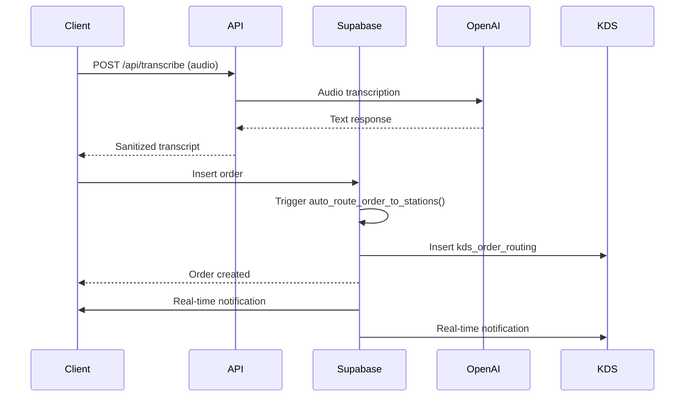
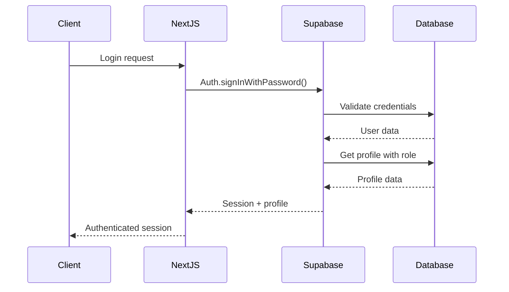

# API Architecture Guide (#heyluis Backend Focus)

## Complete API Reference for Plate Restaurant System

This guide provides comprehensive coverage of the API architecture, endpoints, data flows, and integration patterns for backend development and maintenance.

## API Architecture Overview

### Core API Design Principles

- **RESTful Patterns**: Standard HTTP methods and status codes
- **Authentication-First**: All endpoints require valid authentication
- **Role-Based Access**: Endpoints respect user roles and permissions
- **Real-time Integration**: WebSocket subscriptions for live updates
- **Error Consistency**: Standardized error response format

### Technology Stack

```typescript
// Core API Infrastructure
- Next.js API Routes (Server-side)
- Supabase Client (Database operations)
- OpenAI API (Voice transcription)
- Real-time subscriptions (WebSocket)
- TypeScript (Type safety)
```

## API Endpoints Reference

### Authentication & Session Management

#### `GET /api/auth-check`
**Purpose**: Validate user session and retrieve role information

```typescript
// Request
GET /api/auth-check
Headers: {
  Cookie: sb-access-token=...; sb-refresh-token=...
}

// Response (Success)
{
  "authenticated": true,
  "user": {
    "id": "uuid",
    "email": "user@example.com",
    "role": "server" | "admin" | "cook" | "resident"
  },
  "session": {
    "access_token": "jwt_token",
    "expires_at": 1234567890
  }
}

// Response (Unauthenticated)
{
  "authenticated": false,
  "error": "No active session"
}
```

**Implementation**:
```typescript
// app/api/auth-check/route.ts
import { createRouteHandlerClient } from '@supabase/auth-helpers-nextjs'
import { cookies } from 'next/headers'

export async function GET() {
  const supabase = createRouteHandlerClient({ cookies })
  
  const { data: { session }, error } = await supabase.auth.getSession()
  
  if (!session) {
    return NextResponse.json({ authenticated: false }, { status: 401 })
  }

  // Get user profile with role
  const { data: profile } = await supabase
    .from('profiles')
    .select('role, name')
    .eq('user_id', session.user.id)
    .single()

  return NextResponse.json({
    authenticated: true,
    user: {
      id: session.user.id,
      email: session.user.email,
      role: profile?.role
    },
    session: {
      access_token: session.access_token,
      expires_at: session.expires_at
    }
  })
}
```

### Voice Processing

#### `POST /api/transcribe`
**Purpose**: Convert audio to text using OpenAI Whisper API

```typescript
// Request
POST /api/transcribe
Content-Type: multipart/form-data
Body: FormData {
  audio: File (audio/wav, audio/mp3, audio/webm)
}

// Response (Success)
{
  "success": true,
  "transcript": "chicken salad and water please",
  "confidence": 0.95,
  "processing_time": 2340
}

// Response (Error)
{
  "success": false,
  "error": "Transcription failed",
  "details": "Audio file too large"
}
```

**Implementation**:
```typescript
// app/api/transcribe/route.ts
import OpenAI from 'openai'

const openai = new OpenAI({
  apiKey: process.env.OPENAI_API_KEY,
})

export async function POST(request: Request) {
  try {
    const formData = await request.formData()
    const audioFile = formData.get('audio') as File
    
    if (!audioFile) {
      return NextResponse.json(
        { success: false, error: 'No audio file provided' },
        { status: 400 }
      )
    }

    // Convert to supported format
    const audioBuffer = await audioFile.arrayBuffer()
    const audioBlob = new Blob([audioBuffer], { type: 'audio/wav' })
    
    const startTime = Date.now()
    
    const transcription = await openai.audio.transcriptions.create({
      file: audioBlob,
      model: 'whisper-1',
      language: 'en',
      response_format: 'json'
    })
    
    const processingTime = Date.now() - startTime
    
    // Sanitize transcript
    const sanitizedText = transcription.text
      .replace(/<[^>]*>/g, '') // Remove HTML
      .replace(/[^\w\s,.-]/g, '') // Safe characters only
      .trim()
      .slice(0, 500) // Limit length

    return NextResponse.json({
      success: true,
      transcript: sanitizedText,
      confidence: 0.95, // OpenAI doesn't return confidence
      processing_time: processingTime
    })
    
  } catch (error) {
    console.error('Transcription error:', error)
    return NextResponse.json(
      { success: false, error: 'Transcription failed' },
      { status: 500 }
    )
  }
}
```

### Environment & Debugging

#### `GET /api/vercel-auth`
**Purpose**: Environment variable validation and debugging

```typescript
// Response
{
  "environment": "production" | "development",
  "supabase_configured": boolean,
  "openai_configured": boolean,
  "vercel_deployment": boolean,
  "git_commit": "sha_hash",
  "build_time": "2024-01-01T00:00:00Z"
}
```

## Database API Patterns

### Supabase Client Operations

#### Standard Query Pattern
```typescript
// lib/modassembly/supabase/database/orders.ts
export async function createOrder(orderData: CreateOrderRequest) {
  const supabase = createClient()
  
  const { data, error } = await supabase
    .from('orders')
    .insert({
      table_id: orderData.tableId,
      seat_id: orderData.seatId,
      resident_id: orderData.residentId,
      server_id: orderData.serverId,
      items: orderData.items,
      transcript: orderData.transcript,
      type: orderData.type,
      status: 'new'
    })
    .select(`
      *,
      table:tables(label, type),
      seat:seats(label),
      resident:profiles!resident_id(name),
      server:profiles!server_id(name)
    `)
    .single()

  if (error) {
    throw new Error(`Failed to create order: ${error.message}`)
  }

  return data
}
```

#### Real-time Subscription Pattern
```typescript
// hooks/use-kds-orders.ts
export function useKDSOrders(stationId: string) {
  const [orders, setOrders] = useState<KDSOrder[]>([])
  const [loading, setLoading] = useState(true)

  useEffect(() => {
    const supabase = createClient()

    // Initial fetch
    async function fetchOrders() {
      const { data } = await supabase
        .from('kds_order_routing')
        .select(`
          *,
          order:orders(*),
          station:kds_stations(*)
        `)
        .eq('station_id', stationId)
        .is('completed_at', null)
        .order('routed_at', { ascending: true })

      setOrders(data || [])
      setLoading(false)
    }

    fetchOrders()

    // Real-time subscription
    const channel = supabase
      .channel('kds-orders-updates')
      .on(
        'postgres_changes',
        { 
          event: '*', 
          schema: 'public', 
          table: 'kds_order_routing',
          filter: `station_id=eq.${stationId}`
        },
        (payload) => {
          if (payload.eventType === 'INSERT') {
            setOrders(prev => [...prev, payload.new as KDSOrder])
          } else if (payload.eventType === 'UPDATE') {
            setOrders(prev => prev.map(order => 
              order.id === payload.new.id ? payload.new as KDSOrder : order
            ))
          } else if (payload.eventType === 'DELETE') {
            setOrders(prev => prev.filter(order => order.id !== payload.old.id))
          }
        }
      )
      .subscribe()

    return () => {
      supabase.removeChannel(channel)
    }
  }, [stationId])

  return { orders, loading }
}
```

## Data Flow Architecture

### Order Creation Flow



### Authentication Flow



## Error Handling Patterns

### Standardized Error Response

```typescript
// types/api.ts
export interface APIError {
  success: false
  error: string
  code?: string
  details?: any
  timestamp: string
  request_id: string
}

export interface APISuccess<T> {
  success: true
  data: T
  timestamp: string
  request_id: string
}

// lib/api-helpers.ts
export function createErrorResponse(
  error: string, 
  code?: string, 
  status: number = 500
): NextResponse {
  return NextResponse.json({
    success: false,
    error,
    code,
    timestamp: new Date().toISOString(),
    request_id: crypto.randomUUID()
  }, { status })
}

export function createSuccessResponse<T>(
  data: T, 
  status: number = 200
): NextResponse {
  return NextResponse.json({
    success: true,
    data,
    timestamp: new Date().toISOString(),
    request_id: crypto.randomUUID()
  }, { status })
}
```

### Common Error Scenarios

```typescript
// Authentication errors
if (!session) {
  return createErrorResponse(
    'Authentication required',
    'AUTH_REQUIRED',
    401
  )
}

// Permission errors
if (!hasPermission(session.user.role, 'create_order')) {
  return createErrorResponse(
    'Insufficient permissions',
    'PERMISSION_DENIED',
    403
  )
}

// Validation errors
if (!isValidOrderData(orderData)) {
  return createErrorResponse(
    'Invalid order data',
    'VALIDATION_ERROR',
    400
  )
}

// Database errors
if (error?.code === 'PGRST116') {
  return createErrorResponse(
    'Record not found',
    'NOT_FOUND',
    404
  )
}
```

## Real-time API Integration

### WebSocket Subscription Management

```typescript
// lib/real-time-manager.ts
export class RealTimeManager {
  private supabase: SupabaseClient
  private channels: Map<string, RealtimeChannel> = new Map()

  constructor(supabase: SupabaseClient) {
    this.supabase = supabase
  }

  subscribeToOrders(callback: (payload: any) => void): string {
    const channelId = `orders-${crypto.randomUUID()}`
    
    const channel = this.supabase
      .channel(channelId)
      .on(
        'postgres_changes',
        { event: '*', schema: 'public', table: 'orders' },
        callback
      )
      .subscribe()

    this.channels.set(channelId, channel)
    return channelId
  }

  subscribeToKDS(stationId: string, callback: (payload: any) => void): string {
    const channelId = `kds-${stationId}-${crypto.randomUUID()}`
    
    const channel = this.supabase
      .channel(channelId)
      .on(
        'postgres_changes',
        { 
          event: '*', 
          schema: 'public', 
          table: 'kds_order_routing',
          filter: `station_id=eq.${stationId}`
        },
        callback
      )
      .subscribe()

    this.channels.set(channelId, channel)
    return channelId
  }

  unsubscribe(channelId: string): void {
    const channel = this.channels.get(channelId)
    if (channel) {
      this.supabase.removeChannel(channel)
      this.channels.delete(channelId)
    }
  }

  unsubscribeAll(): void {
    for (const [id, channel] of this.channels) {
      this.supabase.removeChannel(channel)
    }
    this.channels.clear()
  }
}
```

## Performance Optimization

### Query Optimization Patterns

```typescript
// Efficient order fetching with relationships
export async function getOrdersWithDetails(filters: OrderFilters) {
  const query = supabase
    .from('orders')
    .select(`
      id,
      items,
      status,
      type,
      created_at,
      table:tables!inner(id, label),
      seat:seats!inner(id, label),
      resident:profiles!resident_id(name),
      server:profiles!server_id(name)
    `)

  // Apply filters conditionally
  if (filters.status) {
    query.eq('status', filters.status)
  }
  
  if (filters.tableId) {
    query.eq('table_id', filters.tableId)
  }
  
  if (filters.dateRange) {
    query.gte('created_at', filters.dateRange.start)
    query.lte('created_at', filters.dateRange.end)
  }

  // Optimize with indexes
  return query
    .order('created_at', { ascending: false })
    .limit(50) // Reasonable page size
}
```

### Caching Strategies

```typescript
// In-memory caching for frequent queries
const cache = new Map<string, { data: any; timestamp: number }>()
const CACHE_TTL = 5 * 60 * 1000 // 5 minutes

export async function getCachedData<T>(
  key: string,
  fetcher: () => Promise<T>
): Promise<T> {
  const cached = cache.get(key)
  const now = Date.now()

  if (cached && (now - cached.timestamp) < CACHE_TTL) {
    return cached.data
  }

  const data = await fetcher()
  cache.set(key, { data, timestamp: now })
  return data
}

// Usage
const orders = await getCachedData(
  `orders-${tableId}`,
  () => getOrdersForTable(tableId)
)
```

## Security Implementation

### Input Validation

```typescript
// lib/validation.ts
import { z } from 'zod'

export const CreateOrderSchema = z.object({
  tableId: z.string().uuid(),
  seatId: z.string().uuid(),
  residentId: z.string().uuid().optional(),
  serverId: z.string().uuid(),
  items: z.array(z.string()).min(1).max(10),
  transcript: z.string().max(500).optional(),
  type: z.enum(['food', 'beverage', 'dessert']),
  specialRequests: z.string().max(200).optional()
})

export function validateOrderData(data: unknown): CreateOrderRequest {
  return CreateOrderSchema.parse(data)
}
```

### Rate Limiting

```typescript
// lib/rate-limit.ts
const rateLimitMap = new Map<string, { count: number; timestamp: number }>()

export function rateLimit(
  identifier: string,
  maxRequests: number = 10,
  windowMs: number = 60000
): boolean {
  const now = Date.now()
  const record = rateLimitMap.get(identifier)

  if (!record || (now - record.timestamp) > windowMs) {
    rateLimitMap.set(identifier, { count: 1, timestamp: now })
    return true
  }

  if (record.count >= maxRequests) {
    return false
  }

  record.count++
  return true
}

// Usage in API route
export async function POST(request: Request) {
  const clientIP = request.headers.get('x-forwarded-for') || 'unknown'
  
  if (!rateLimit(clientIP, 5, 60000)) {
    return createErrorResponse(
      'Rate limit exceeded',
      'RATE_LIMIT',
      429
    )
  }
  
  // Continue with request processing
}
```

## Integration Points

### Third-Party Service Integration

```typescript
// lib/integrations/printer.ts
export interface PrinterService {
  printReceipt(order: Order): Promise<void>
  printKitchenTicket(order: Order): Promise<void>
  getStatus(): Promise<PrinterStatus>
}

// Mock implementation (replace with actual printer SDK)
export class ThermalPrinterService implements PrinterService {
  async printReceipt(order: Order): Promise<void> {
    // Format receipt data
    const receiptData = {
      orderNumber: order.id.slice(-6).toUpperCase(),
      items: order.items,
      timestamp: order.created_at,
      total: this.calculateTotal(order.items)
    }
    
    // Send to printer API/SDK
    console.log('Printing receipt:', receiptData)
  }

  async printKitchenTicket(order: Order): Promise<void> {
    const ticketData = {
      orderNumber: order.id.slice(-6).toUpperCase(),
      table: order.table?.label,
      seat: order.seat?.label,
      items: order.items,
      specialRequests: order.special_requests,
      timestamp: order.created_at
    }
    
    console.log('Printing kitchen ticket:', ticketData)
  }

  async getStatus(): Promise<PrinterStatus> {
    return {
      connected: true,
      paperLevel: 'ok',
      lastError: null
    }
  }

  private calculateTotal(items: string[]): number {
    // Price calculation logic
    return items.length * 12.50 // Mock pricing
  }
}
```

## API Documentation Generation

### OpenAPI Specification

```yaml
# docs/api/openapi.yaml
openapi: 3.0.0
info:
  title: Plate Restaurant System API
  version: 1.0.0
  description: Complete API reference for restaurant management system

paths:
  /api/auth-check:
    get:
      summary: Check authentication status
      responses:
        '200':
          description: Authentication status
          content:
            application/json:
              schema:
                type: object
                properties:
                  authenticated:
                    type: boolean
                  user:
                    type: object
                    properties:
                      id:
                        type: string
                        format: uuid
                      email:
                        type: string
                        format: email
                      role:
                        type: string
                        enum: [admin, server, cook, resident]

  /api/transcribe:
    post:
      summary: Transcribe audio to text
      requestBody:
        content:
          multipart/form-data:
            schema:
              type: object
              properties:
                audio:
                  type: string
                  format: binary
      responses:
        '200':
          description: Transcription result
          content:
            application/json:
              schema:
                type: object
                properties:
                  success:
                    type: boolean
                  transcript:
                    type: string
                  confidence:
                    type: number
                  processing_time:
                    type: number
```

## Monitoring and Observability

### API Metrics Collection

```typescript
// lib/metrics.ts
export interface APIMetric {
  endpoint: string
  method: string
  status: number
  duration: number
  timestamp: number
  userId?: string
}

class MetricsCollector {
  private metrics: APIMetric[] = []

  track(metric: APIMetric): void {
    this.metrics.push(metric)
    
    // Persist to database or external service
    this.persistMetric(metric)
  }

  getMetrics(timeRange?: { start: number; end: number }): APIMetric[] {
    if (!timeRange) return this.metrics
    
    return this.metrics.filter(m => 
      m.timestamp >= timeRange.start && m.timestamp <= timeRange.end
    )
  }

  private async persistMetric(metric: APIMetric): Promise<void> {
    // Store in database for analytics
    const supabase = createClient()
    await supabase
      .from('api_metrics')
      .insert({
        endpoint: metric.endpoint,
        method: metric.method,
        status: metric.status,
        duration_ms: metric.duration,
        user_id: metric.userId,
        recorded_at: new Date(metric.timestamp).toISOString()
      })
  }
}

export const metrics = new MetricsCollector()
```

### Performance Monitoring

```typescript
// middleware.ts (Next.js middleware)
import { NextResponse } from 'next/server'
import type { NextRequest } from 'next/server'
import { metrics } from './lib/metrics'

export function middleware(request: NextRequest) {
  const start = Date.now()

  return NextResponse.next().then(response => {
    const duration = Date.now() - start
    
    // Track API performance
    if (request.nextUrl.pathname.startsWith('/api/')) {
      metrics.track({
        endpoint: request.nextUrl.pathname,
        method: request.method,
        status: response.status,
        duration,
        timestamp: start,
        userId: request.headers.get('x-user-id') || undefined
      })
    }

    return response
  })
}

export const config = {
  matcher: '/api/:path*'
}
```

## Deployment Considerations

### Environment Configuration

```typescript
// lib/env.ts
import { z } from 'zod'

const envSchema = z.object({
  NEXT_PUBLIC_SUPABASE_URL: z.string().url(),
  NEXT_PUBLIC_SUPABASE_ANON_KEY: z.string(),
  SUPABASE_SERVICE_ROLE_KEY: z.string(),
  OPENAI_API_KEY: z.string(),
  NODE_ENV: z.enum(['development', 'production', 'test']),
  VERCEL: z.string().optional(),
  VERCEL_URL: z.string().optional()
})

export const env = envSchema.parse(process.env)

export function isProduction(): boolean {
  return env.NODE_ENV === 'production'
}

export function isDevelopment(): boolean {
  return env.NODE_ENV === 'development'
}
```

### Health Check Endpoint

```typescript
// app/api/health/route.ts
export async function GET() {
  const checks = await Promise.allSettled([
    checkDatabase(),
    checkOpenAI(),
    checkStorage()
  ])

  const results = checks.map((check, index) => ({
    service: ['database', 'openai', 'storage'][index],
    status: check.status === 'fulfilled' ? 'healthy' : 'unhealthy',
    details: check.status === 'rejected' ? check.reason : 'OK'
  }))

  const allHealthy = results.every(r => r.status === 'healthy')

  return NextResponse.json({
    status: allHealthy ? 'healthy' : 'degraded',
    timestamp: new Date().toISOString(),
    checks: results
  }, {
    status: allHealthy ? 200 : 503
  })
}

async function checkDatabase(): Promise<void> {
  const supabase = createClient()
  const { error } = await supabase.from('profiles').select('id').limit(1)
  if (error) throw new Error(`Database: ${error.message}`)
}

async function checkOpenAI(): Promise<void> {
  // Test OpenAI connectivity
  const response = await fetch('https://api.openai.com/v1/models', {
    headers: { Authorization: `Bearer ${env.OPENAI_API_KEY}` }
  })
  if (!response.ok) throw new Error('OpenAI API unavailable')
}

async function checkStorage(): Promise<void> {
  const supabase = createClient()
  const { error } = await supabase.storage.from('audio-recordings').list('', { limit: 1 })
  if (error) throw new Error(`Storage: ${error.message}`)
}
```

This API architecture provides a robust foundation for the Plate Restaurant System with clear patterns for authentication, data flow, error handling, and real-time updates optimized for assisted living facility operations.